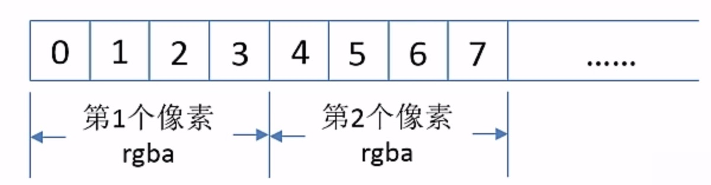

###1 `drawImage()`
> 在 canvas 上绘制图片

语法：
```
ctx.drawImage(img, dx, dy);
ctx.drawImage(img, dx, dy, dWidth, dHeight);
ctx.drawImage(img, sx, sy, sWidth, sHeight, dx, dy, dWidth, dHeight );
```

参数值：


| 参数 | 描述 |
|--------|--------|
|    img    |   绘制到上下文的元素.HTMLImageElement，HTMLVideoElement，或者 HTMLCanvasElement。     |
|    dx    |   源图像的左上角在目标canvas上 X 轴的位置。     |
|    dy    |   源图像的左上角在目标canvas上 Y 轴的位置。     |
|    dWidth    |   在目标canvas上绘制图像的宽度。允许对绘制的图像进行缩放。     |
|    dHeight    |   在目标canvas上绘制图像的高度。允许对绘制的图像进行缩放。     |
|    sx    |   需要绘制到目标上下文中的，源图像的矩形选择框的左上角 X 坐标。     |
|    sy    |  需要绘制到目标上下文中的，源图像的矩形选择框的左上角 Y 坐标。     |
|    sWidth    |  需要绘制到目标上下文中的，源图像的矩形选择框的宽度。     |
|    sHeight    |  需要绘制到目标上下文中的，源图像的矩形选择框的高度。     |


###2. `clearRect()`
> 设置指定矩形区域内（以 点 (x, y) 为起点，范围是(width, height) ）所有像素变成透明，并擦除之前绘制的所有内容的方法。

语法：
```
ctx.clearRect(x, y, width, height);
```

参数值：


| 参数 | 描述 |
|--------|--------|
|    x    |   要清除的矩形左上角的 x 坐标     |
|    y    |   要清除的矩形左上角的 y 坐标     |
|    width    |   要清除的矩形的宽度     |
|    height    |   要清除的矩形的高度     |

###3. 离屏canvas
>离屏canvas经常用来存放临时性的图像信息

使离屏canvas遵循的四个步骤：

1. 创建用做离屏canvas的元素
（`var offscreenCanvas = document.createElement('canvas');`创建一个不从属于任何DOM元素的canvas对象，因此该canvas是不可见的，这也是它为何被叫做离屏canvas的原因）
2. 设置离屏canvas的宽度与高度
3. 在离屏canvas之中进行绘制
4. 将离屏canvas的全部或者一部分内容复制到正在显示的canvas之中

###4. 操作图像的像素
>对图像之中的像素进行任何可见的操作，获取图像的像素值，向图像中插入像素，修改像素值。

- `getImageData()`获取图像的像素信息
- `putImageData()`向图像中插入像素


####4.1 `getImageData()`
>返回一个ImageData对象，用来描述canvas区域隐含的像素数据，这个区域通过矩形表示，起始点为(sx, sy)、宽为sw、高为sh。

```
ctx.getImageData(sx, sy, sw, sh);
```
| 参数 | 描述 |
|--------|--------|
|    sx    |   将要被提取的图像数据矩形区域的左上角 x 坐标    |
|    sy    |   将要被提取的图像数据矩形区域的左上角 y 坐标     |
|    sw    |   将要被提取的图像数据矩形区域的宽度     |
|    sh    |   将要被提取的图像数据矩形区域的高度     |
返回值：一个ImageData 对象，包含canvas给定的矩形图像数据。

####4.2 `ImageData`对象
| 属性 | 描述 |
|--------|--------|
|    width    |   使用像素描述`ImageData`的实际宽度    |
|    height    |   使用像素描述`ImageData`的实际高度     |
|    data    |  描述了一个一维数组，包含以 RGBA 顺序的数据，数据使用  0 至 255（包含）的整数表示。     |

**imageData.data**


第i个像素

R： `imageData.data[4 * i + 0]`

G： `imageData.data[4 * i + 1]`

B： `imageData.data[4 * i + 2]`

A： `imageData.data[4 * i + 3]`


坐标（x,y）,y行x列

`i = y*width + x`

R： `imageData.data[4 * i + 0]`

G： `imageData.data[4 * i + 1]`

B： `imageData.data[4 * i + 2]`

A： `imageData.data[4 * i + 3]`

